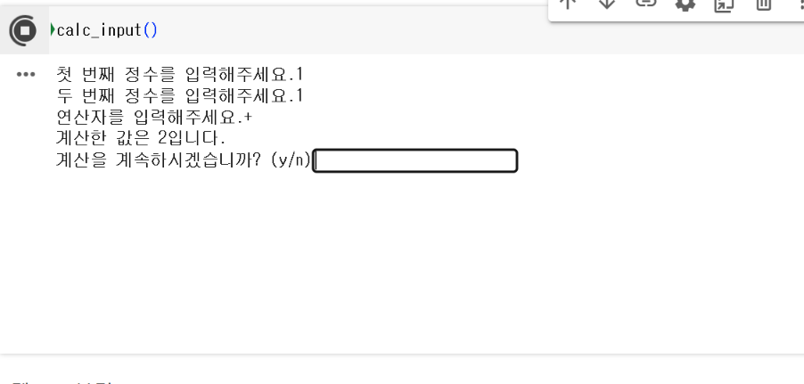
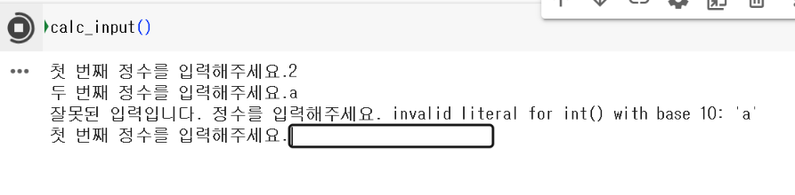
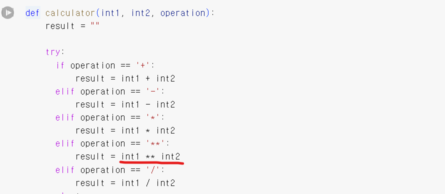

# AIFFEL Campus Online Code Peer Review Templete
- 코더 : 코더의 이름을 작성하세요.
- 리뷰어 : 리뷰어의 이름을 작성하세요.


# PRT(Peer Review Template)
- [ ]  **1. 주어진 문제를 해결하는 완성된 코드가 제출되었나요?**
    - 
    - 계산 결과
    - 
    - 올바르지 않은 정수가 입력되면 다시 입력받음.
    - 
    - 올바르지 않은 연산자가 입력되면 다시 입력받음.
    - 
    - 0으로 나누는 경우 zeroDivisionError가 발생됨.
    - 
    - math pow() 함수를 사용해서 제곱 연산을 하는 방식으로 구현하지 않은 이유는 무엇인가요?
- [ ]  **2. 전체 코드에서 가장 핵심적이거나 가장 복잡하고 이해하기 어려운 부분에 작성된 
주석 또는 doc string을 보고 해당 코드가 잘 이해되었나요?**
    - 주석은 사용하지 않았지만, 코드를 이해하는 데 문제없었습니다.
        
- [ ]  **3. 에러가 난 부분을 디버깅하여 문제를 해결한 기록을 남겼거나
새로운 시도 또는 추가 실험을 수행해봤나요?**
    - 
        
- [ ]  **4. 회고를 잘 작성했나요?**
        
- [ ]  **5. 코드가 간결하고 효율적인가요?**
    - 파이썬 스타일 가이드 (PEP8) 를 준수하였는지 확인
    - 연산자를 검증하면서 문제가 없는 경우에 연산을 하는 과정이 인상적이었습니다.
    - 연산자를 검증하기 위해 if, elif를 여러 번 사용한 부분에 대해 리뷰를 진행하면서 어떻게 바꾸면 좋을 지 고민하는 모습이 보였습니다. 해당 고민을 토대로 좀 더 깔끔하게 작성해보시면 좋을 것 같습니다!


# 회고(참고 링크 및 코드 개선)
```
# 리뷰어의 회고를 작성합니다.
# 코드 리뷰 시 참고한 링크가 있다면 링크와 간략한 설명을 첨부합니다.
# 코드 리뷰를 통해 개선한 코드가 있다면 코드와 간략한 설명을 첨부합니다.
```
